# 🎬 Cinemateca — Catálogo de películas con Django

Proyecto del curso que construye un catálogo de películas con **Django** y explota a fondo el **panel de administración**: modelos relacionados, personalización con `ModelAdmin`, *inlines*, campos de solo lectura, permisos por grupos y, como contraste, una **vista pública de recomendaciones** escrita a mano.

| | |
|---|---|
| **Framework** | Django 5.2 |
| **Imágenes** | Pillow (pósters y fotos con `ImageField`) |
| **Base de datos** | SQLite |
| **Proyecto** | `cinemateca` |
| **Aplicación** | `movies` |

---

## Índice

1. [Estructura del proyecto](#1-estructura-del-proyecto)
2. [Instalación y puesta en marcha](#2-instalación-y-puesta-en-marcha)
3. [Modelos y relaciones](#3-modelos-y-relaciones)
4. [Registro en el panel y CRUD](#4-registro-en-el-panel-y-crud)
5. [Personalización con `ModelAdmin`](#5-personalización-con-modeladmin)
6. [Valoraciones en línea (*inlines*)](#6-valoraciones-en-línea-inlines)
7. [Campos de auditoría de solo lectura](#7-campos-de-auditoría-de-solo-lectura)
8. [Datos de prueba](#8-datos-de-prueba)
9. [Permisos y roles: grupo «editores»](#9-permisos-y-roles-grupo-editores)
10. [Vista pública de recomendación](#10-vista-pública-de-recomendación)
11. [Evidencias: antes y después](#11-evidencias-antes-y-después)
12. [Pruebas automatizadas](#12-pruebas-automatizadas)

---

## 1. Estructura del proyecto

```
movie-catalog-django/
├── cinemateca/                  # Proyecto Django
│   ├── settings.py              # INSTALLED_APPS (+ movies), idioma, MEDIA
│   └── urls.py                  # /admin/, /peliculas/ y archivos MEDIA
├── movies/                      # Aplicación
│   ├── models.py                # Movie, Genre, Person, Rating
│   ├── admin.py                 # ModelAdmin, inlines, filtros, readonly
│   ├── views.py                 # Catálogo y recomendaciones
│   ├── urls.py
│   ├── tests.py
│   ├── templates/movies/        # Plantillas públicas
│   ├── management/commands/
│   │   ├── seed_movies.py       # Datos de prueba
│   │   └── setup_roles.py       # Grupo «editores» + usuario editor
│   └── migrations/
├── docs/
│   ├── capturas/                # Evidencias del entregable
│   └── generar_capturas.py      # Script Playwright para regenerarlas
├── manage.py
└── requirements.txt
```

## 2. Instalación y puesta en marcha

```bash
# 1. Clonar y crear un entorno virtual
git clone https://github.com/luiscucho-oss/movie-catalog-django.git
cd movie-catalog-django
python -m venv .venv
source .venv/bin/activate          # Windows: .venv\Scripts\activate

# 2. Instalar dependencias (Django + Pillow)
pip install -r requirements.txt

# 3. Crear la base de datos
python manage.py migrate

# 4. Crear el superusuario
python manage.py createsuperuser

# 5. Cargar datos de prueba y el grupo «editores»
python manage.py seed_movies
python manage.py setup_roles

# 6. Arrancar el servidor
python manage.py runserver
```

| URL | Descripción |
|---|---|
| http://127.0.0.1:8000/admin/ | Panel de administración |
| http://127.0.0.1:8000/peliculas/ | Catálogo público |
| http://127.0.0.1:8000/peliculas/1/recomendaciones/ | Recomendaciones de una película |

**Usuarios de prueba** (solo para desarrollo, cámbialos en producción):

| Usuario | Contraseña | Rol |
|---|---|---|
| `admin` | `admin12345` | Superusuario (lo creas tú con `createsuperuser`) |
| `editor` | `editor12345` | Miembro del grupo «editores» (lo crea `setup_roles`) |

> `db.sqlite3` y `media/` están en `.gitignore`: cada persona genera su propia base de datos con los comandos anteriores.

## 3. Modelos y relaciones

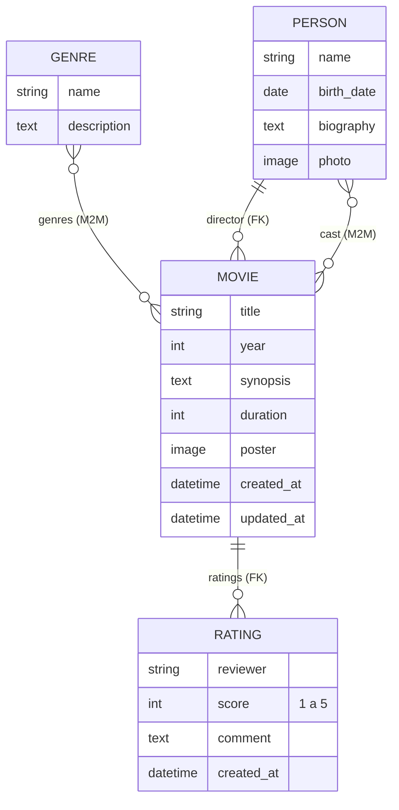

| Modelo | Campos destacados | `Meta` | `__str__` |
|---|---|---|---|
| `Genre` | `name` (único), `description` | `ordering=["name"]` | `Drama` |
| `Person` | `name`, `birth_date`, `photo` (`ImageField`) | `ordering=["name"]` | `Bong Joon-ho` |
| `Movie` | `title`, `year`, `poster`, `director` (FK), `cast` y `genres` (M2M), `created_at`, `updated_at` | `ordering=["-year", "title"]` | `Parásitos (2019)` |
| `Rating` | `movie` (FK), `reviewer`, `score` (1–5 con validadores), `comment` | `ordering=["-created_at"]` | `Parásitos · 5/5 por Ana` |

- **Muchos a muchos:** `Movie.genres` ↔ `Genre.movies`.
- **Clave foránea:** `Rating.movie` → `Movie` (`related_name="ratings"`, `on_delete=CASCADE`).

## 4. Registro en el panel y CRUD

Primero se registraron los cuatro modelos sin personalizar (`admin.site.register`). Con eso, el panel ya permite las cuatro operaciones básicas:

| Crear | Editar |
|---|---|
| 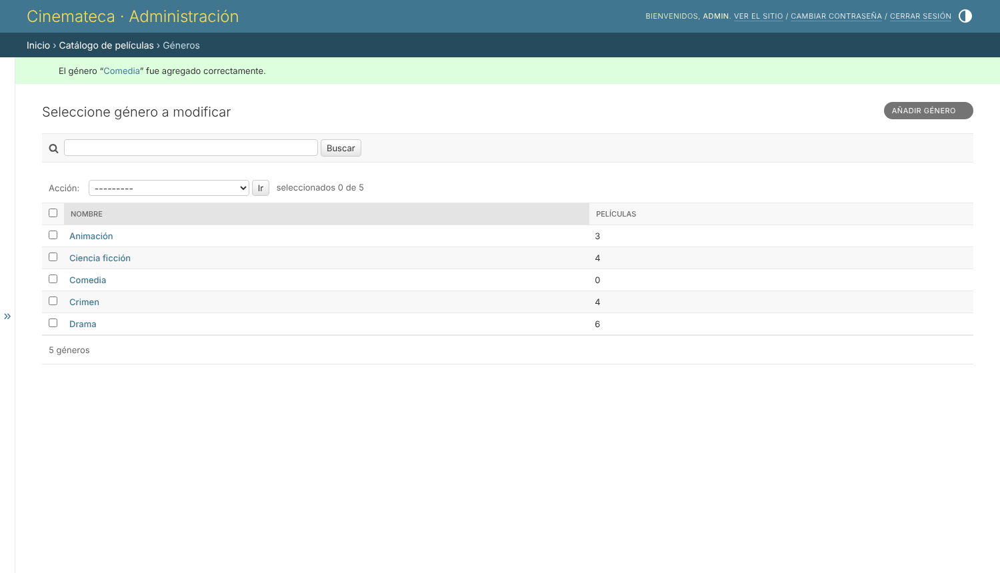 | 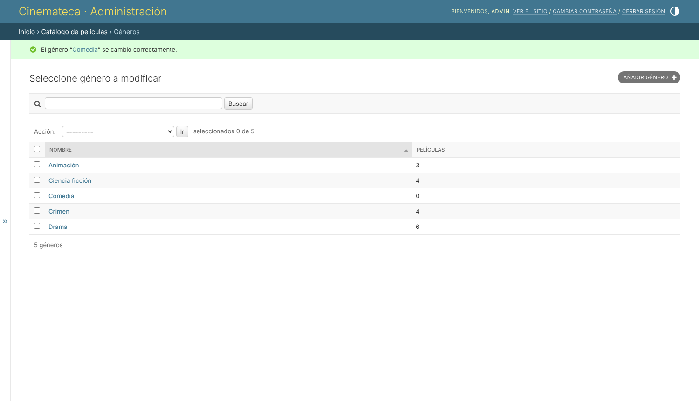 |
| **Confirmar eliminación** | **Eliminado** |
| 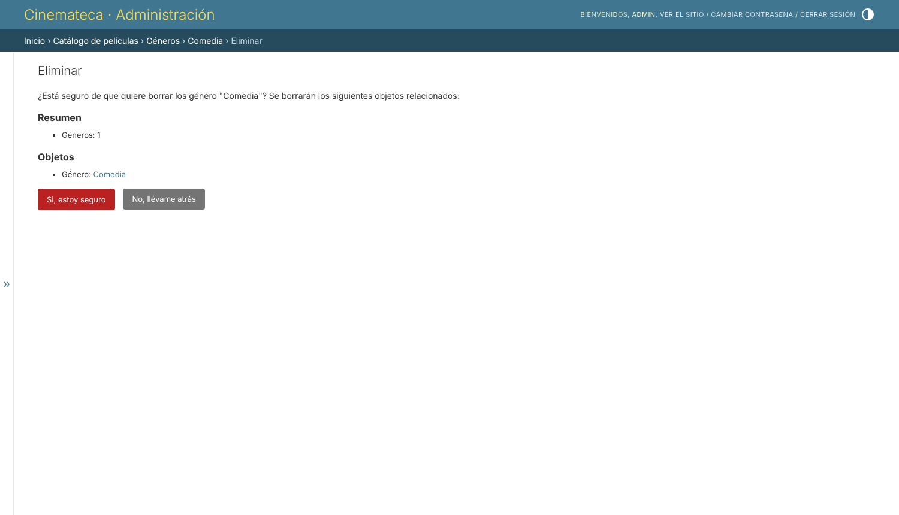 | 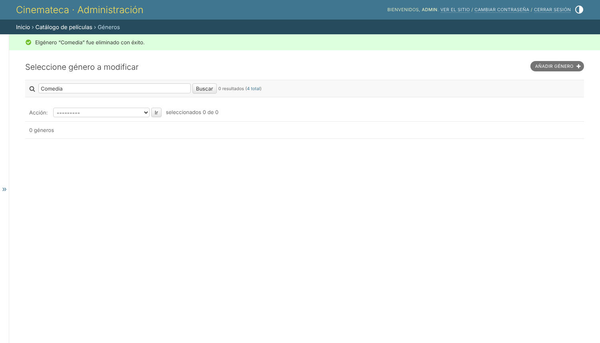 |

## 5. Personalización con `ModelAdmin`

```python
@admin.register(Movie)
class MovieAdmin(admin.ModelAdmin):
    list_display = ("title", "year", "director", "genre_list",
                    "average_score", "ratings_count", "updated_at")
    list_filter = ("genres", "year")
    search_fields = ("title", "director__name", "cast__name")
    filter_horizontal = ("genres", "cast")
    readonly_fields = ("created_at", "updated_at")
    inlines = [RatingInline]
```

- **`list_display`**: columnas útiles. Las calculadas (`genre_list`, `average_score`, `ratings_count`) usan `@admin.display` y se pueden ordenar gracias a `annotate()`.
- **`list_filter`**: filtros laterales por **género** y **año**.
- **`search_fields`**: búsqueda por **título** y por **nombre** de director o actor. `GenreAdmin` y `PersonAdmin` también buscan por nombre.

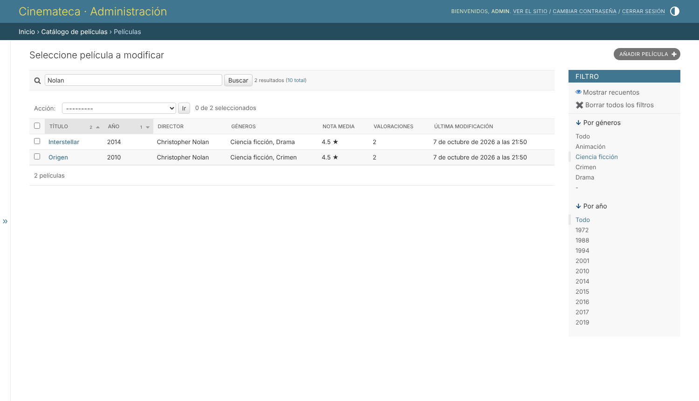
*Filtro «Ciencia ficción» + búsqueda «Nolan».*

## 6. Valoraciones en línea (*inlines*)

```python
class RatingInline(admin.TabularInline):
    model = Rating
    extra = 1
    fields = ("reviewer", "score", "comment", "created_at")
    readonly_fields = ("created_at",)
```

Las valoraciones se dan de alta **dentro del formulario de la película**, sin salir del registro principal:

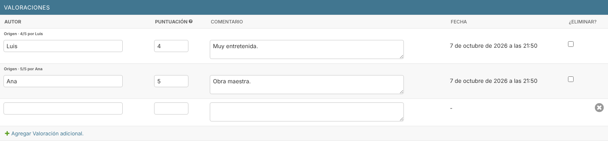

## 7. Campos de auditoría de solo lectura

`created_at` (`auto_now_add`) y `updated_at` (`auto_now`) están en `readonly_fields`. El panel los muestra como texto, sin un campo de entrada, por lo que **no se pueden editar**:

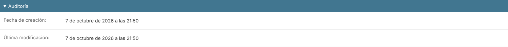

Formulario completo de la película (datos, equipo, clasificación, auditoría e *inline*):

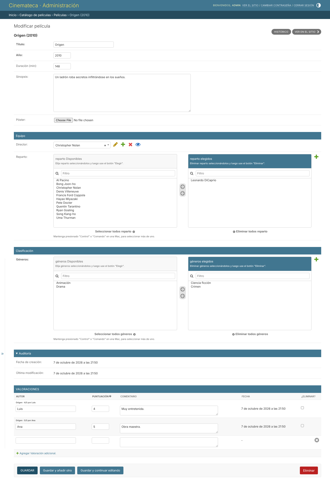

## 8. Datos de prueba

```bash
python manage.py seed_movies
# Datos cargados: 10 películas, 4 géneros, 12 personas, 12 valoraciones.
```

- **4 géneros:** Drama, Ciencia ficción, Animación y Crimen.
- **10 películas:** Origen, Interstellar, El padrino, El viaje de Chihiro, Mi vecino Totoro, Blade Runner 2049, Parásitos, Pulp Fiction, Del revés y La llegada.
- **Valoraciones en 7 películas** (se pedían al menos 5).

El comando es idempotente: se puede ejecutar varias veces sin duplicar datos. Todo lo que carga se puede crear también desde el panel, como se ve en la sección 4.

## 9. Permisos y roles: grupo «editores»

```bash
python manage.py setup_roles
# Grupo «editores» con 8 permisos; usuario «editor» creado.
```

| Modelo | Ver | Añadir | Modificar | Eliminar |
|---|:-:|:-:|:-:|:-:|
| Película | ✅ | ✅ | ✅ | ❌ |
| Valoración | ✅ | ✅ | ✅ | ❌ |
| Género | ✅ | ❌ | ❌ | ❌ |
| Persona | ✅ | ❌ | ❌ | ❌ |
| Usuarios / Grupos | ❌ | ❌ | ❌ | ❌ |

El usuario `editor` tiene `is_staff=True` (puede entrar al panel), pero **no** es superusuario.

**Lo que se oculta al entrar con la cuenta de editor:**
- La sección **«Autenticación y autorización»** (usuarios y grupos).
- Los enlaces «Añadir» y «Modificar» de Géneros y Personas, que pasan a «Vista».
- El botón rojo **«Eliminar»** en el formulario de la película.
- El desplegable **«Acción»** del listado, porque la única acción («Eliminar seleccionados») requiere `delete_movie`.
- La URL directa `/admin/movies/movie/1/delete/` devuelve **403 Forbidden**.

## 10. Vista pública de recomendación

`/peliculas/<id>/recomendaciones/` muestra las **5 películas mejor valoradas que comparten algún género** con la elegida:

```python
recommended = (
    Movie.objects.filter(genres__in=movie.genres.all())
    .exclude(pk=movie.pk)
    .distinct()
    .annotate(avg_score=Avg("ratings__score"),
              ratings_count=Count("ratings", distinct=True))
    .filter(avg_score__isnull=False)
    .order_by("-avg_score", "-ratings_count", "title")[:5]
)
```

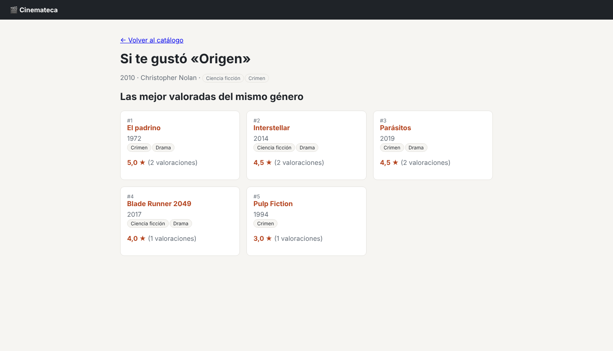

### Panel de administración frente a vista propia

| Aspecto | Panel de administración | Vista propia |
|---|---|---|
| Público | Personal interno (`is_staff`) | Cualquier visitante |
| Código necesario | Declarativo: `list_display`, `list_filter`… | Vista, URL, consulta ORM y plantilla escritas a mano |
| CRUD, formularios, validación | Automáticos | Hay que programarlos |
| Permisos | Integrados (`add`/`change`/`delete`/`view`) | Hay que aplicarlos explícitamente |
| Lógica de negocio («mejor valoradas del mismo género») | No la ofrece | Consulta con `annotate(Avg)` + filtro por géneros |
| Diseño | Fijo, el de Django | Libre (HTML/CSS propios) |

**Conclusión:** el admin resuelve en pocas líneas la **gestión** de datos, pero cualquier funcionalidad **orientada al usuario final** (recomendaciones, rankings, diseño propio) exige una vista personalizada.

Catálogo público:

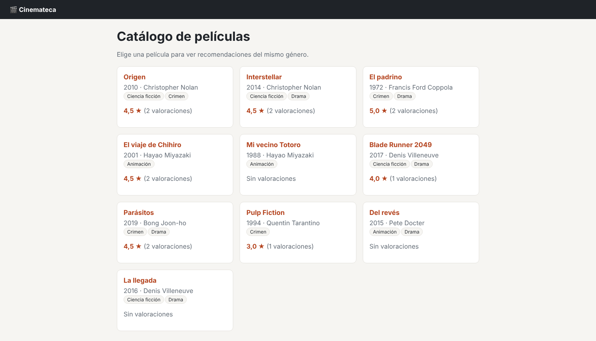

## 11. Evidencias: antes y después

### Listado de películas

| Antes (registro simple) | Después (`ModelAdmin`) |
|---|---|
| 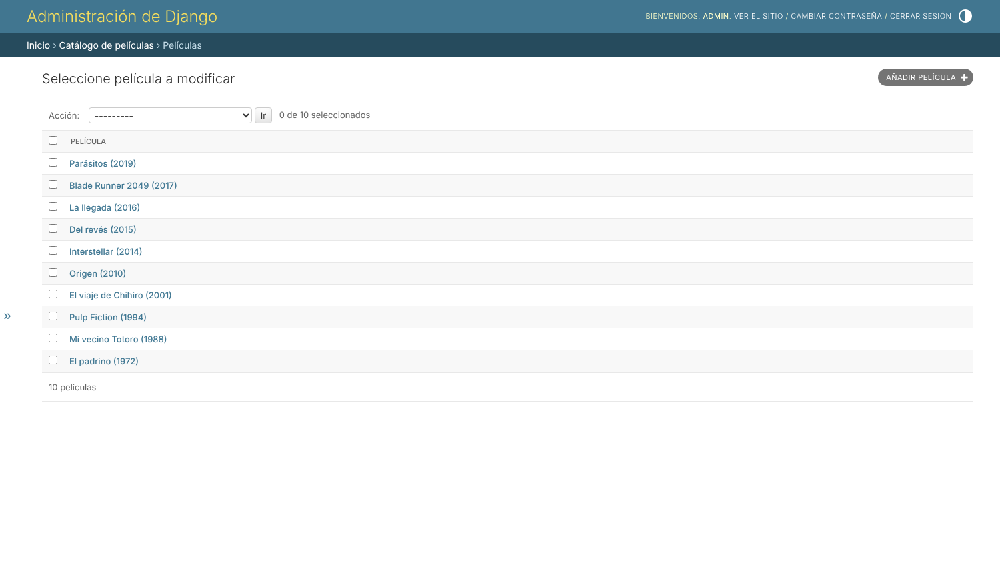 | 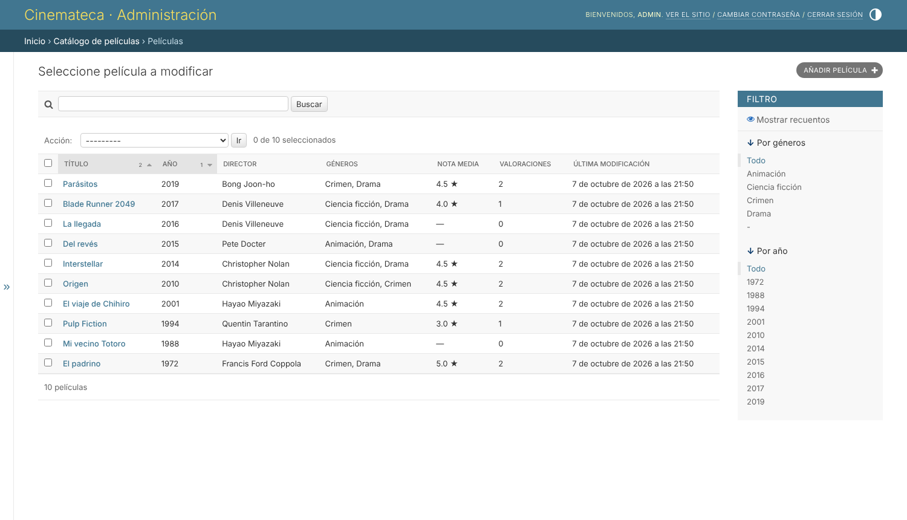 |
| Solo se ve `__str__`; sin búsqueda ni filtros. | Columnas útiles, nota media, búsqueda y filtros por género y año. |

### Formulario de película

| Antes | Después |
|---|---|
| 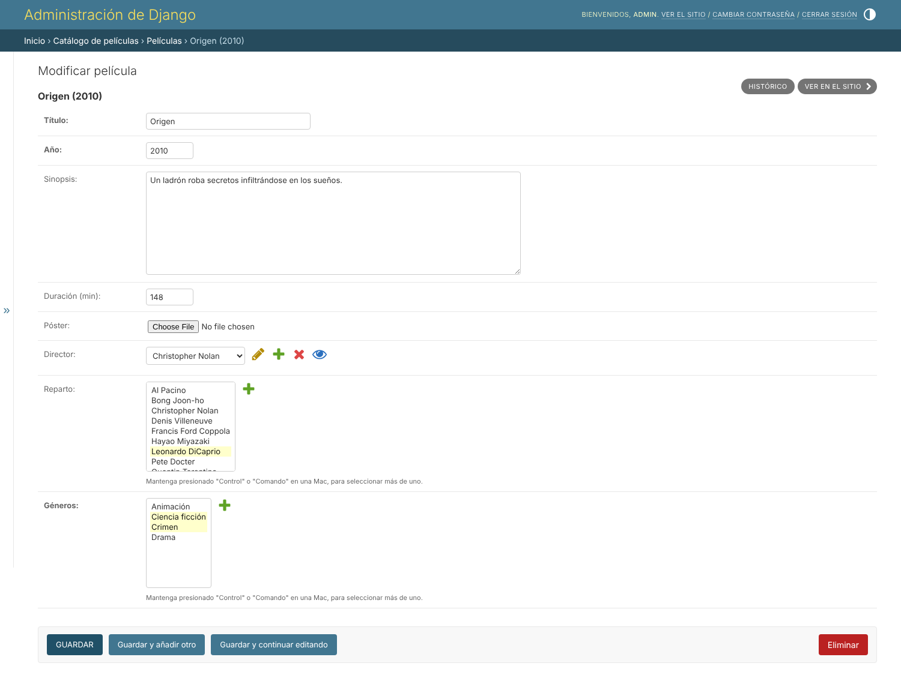 |  |
| Sin agrupar; las fechas de auditoría no aparecen; sin valoraciones. | Secciones (`fieldsets`), selector horizontal, auditoría de solo lectura y valoraciones en línea. |

### Superusuario frente a editor

| Superusuario (`admin`) | Editor (grupo «editores») |
|---|---|
| 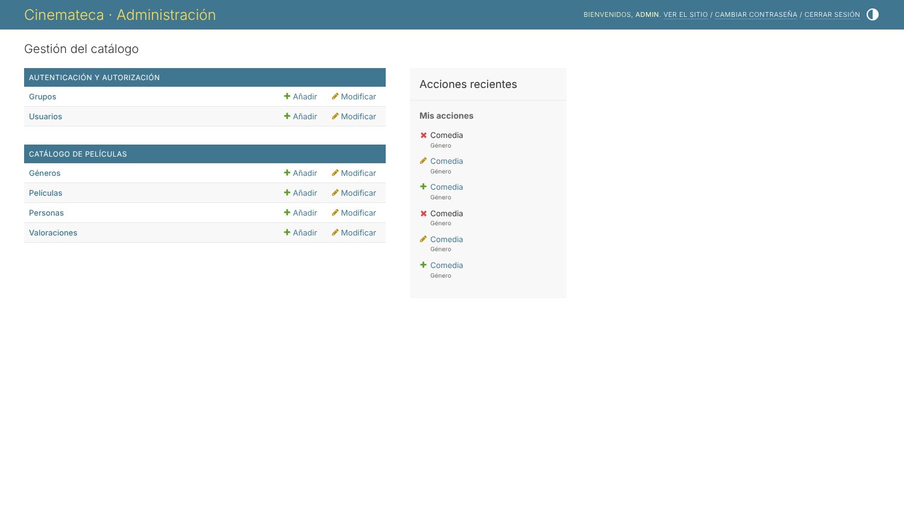 | 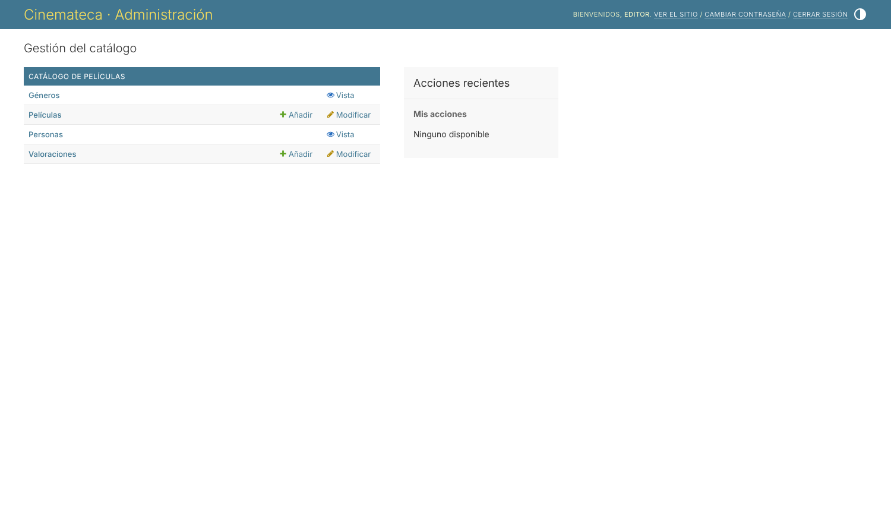 |
| Ve «Autenticación y autorización» y puede añadir y modificar todo. | No ve usuarios ni grupos; géneros y personas solo en modo «Vista». |
|  | 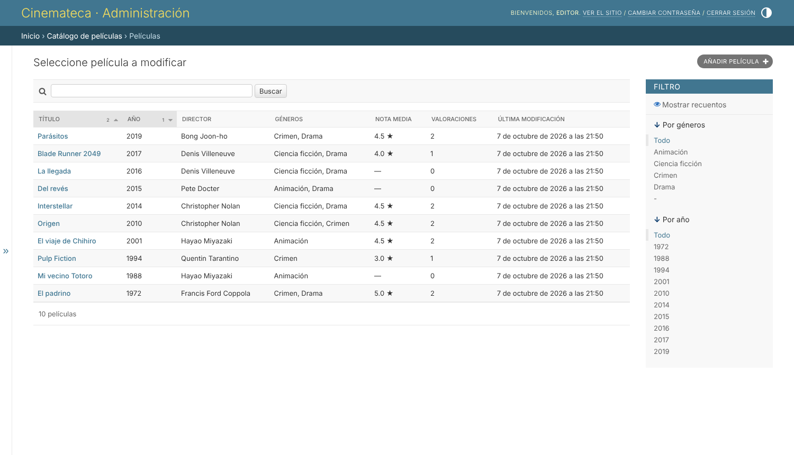 |
| Tiene la barra «Acción» para el borrado masivo. | Sin la barra «Acción»: no puede borrar en bloque. |
|  | 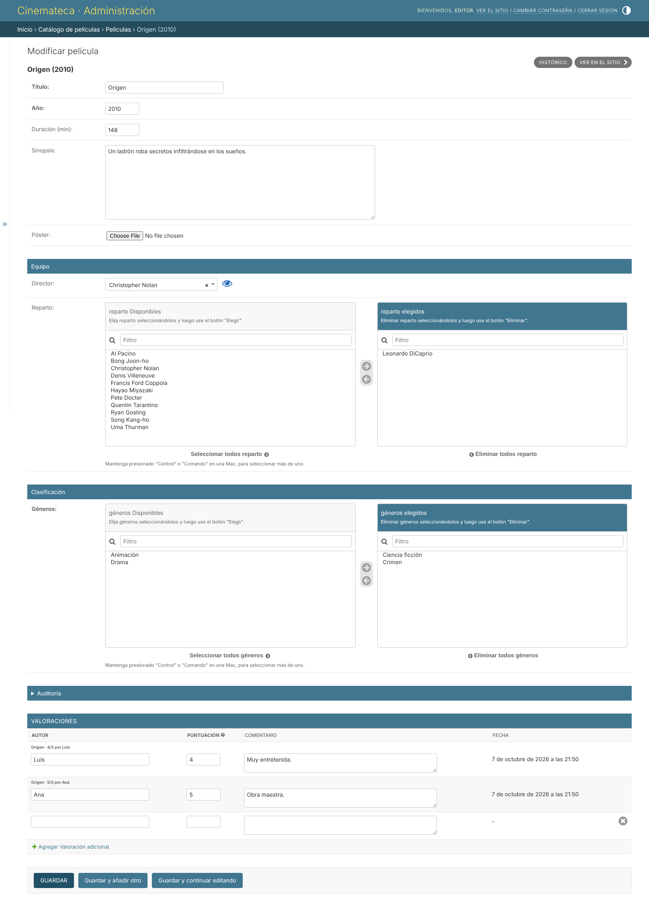 |
| Botón rojo «Eliminar» visible. | Sin el botón «Eliminar». |

| Editor: acceso directo a eliminar | Editor: género en solo lectura |
|---|---|
|  | 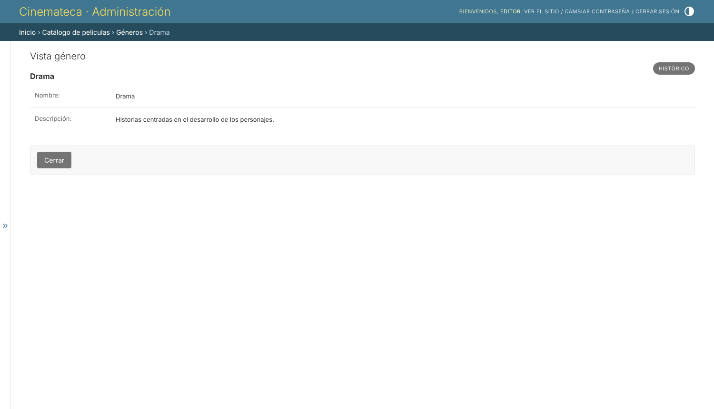 |

> Las capturas se generaron con [`docs/generar_capturas.py`](docs/generar_capturas.py) (Playwright). Para regenerarlas: `pip install playwright && playwright install chromium`, arranca el servidor y ejecuta el script.

## 12. Pruebas automatizadas

```bash
python manage.py test movies
```

Las pruebas cubren:
- `__str__`, las relaciones y los campos de auditoría.
- Que la recomendación devuelva el mismo género ordenado por nota media y responda 404 si la película no existe.
- Que el comando de datos cree 10 películas, 4 géneros y valoraciones en al menos 5.
- Que el editor pueda modificar pero no eliminar (403) y no acceda a usuarios.
- Que los campos de auditoría se muestren sin campo de entrada y que la búsqueda del admin funcione.

---

### Historial de commits

Cada paso del enunciado tiene su propio commit (`git log --oneline`), siguiendo *Conventional Commits*:

```
chore: crear proyecto cinemateca y app movies con Pillow
feat(models): añadir modelos Movie, Genre, Person y Rating
feat(db): generar migraciones iniciales
feat(admin): registrar los cuatro modelos en el panel
feat(admin): personalizar MovieAdmin con filtros, búsqueda e inlines
feat(data): comando seed_movies con datos de prueba
feat(auth): grupo editores con permisos limitados
feat(views): vista pública de recomendaciones por género
test: pruebas de modelos, vista de recomendación y permisos
style(admin): nombre legible de la app y comentarios compactos en el inline
docs: README con instalación, evidencias y capturas
```
