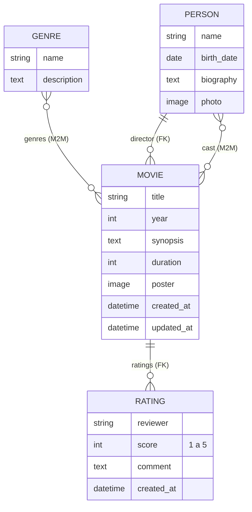
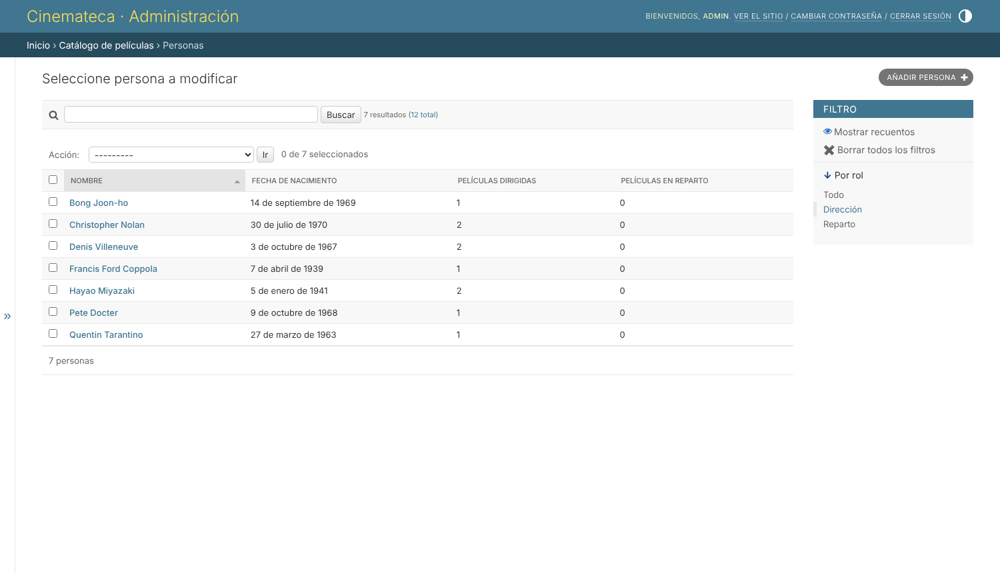
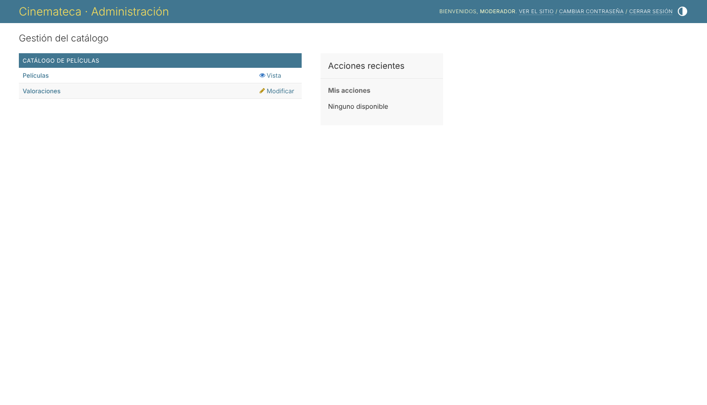
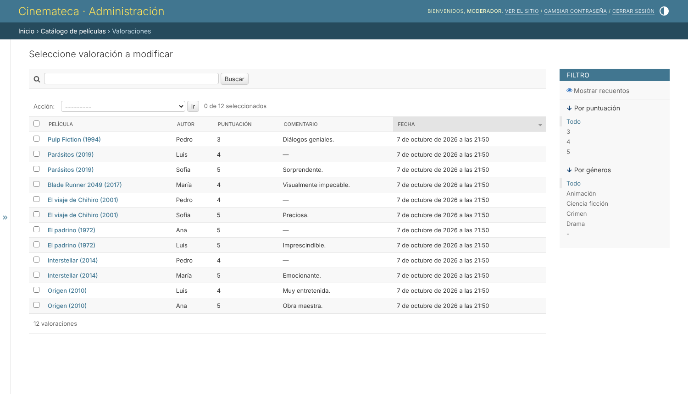
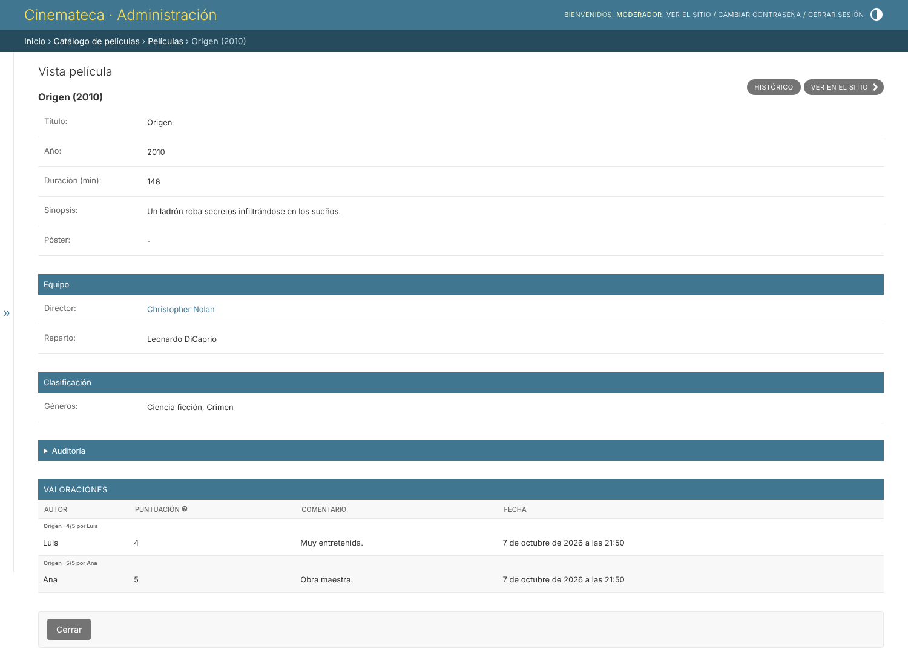

# 🎬 Cinemateca — Catálogo de películas con Django

Proyecto del curso que construye un catálogo de películas con **Django** y explota a fondo el **panel de administración**: modelos relacionados, personalización con `ModelAdmin`, *inlines*, campos de solo lectura, permisos por grupos y, como contraste, una **vista pública de recomendaciones** escrita a mano.

| | |
|---|---|
| **Framework** | Django 5.2 |
| **Imágenes** | Pillow (pósters y fotos con `ImageField`) |
| **Base de datos** | SQLite |
| **Proyecto** | `cinemateca` |
| **Aplicación** | `movies` |

---

## Índice

1. [Estructura del proyecto](#1-estructura-del-proyecto)
2. [Instalación y puesta en marcha](#2-instalación-y-puesta-en-marcha)
3. [Modelos y relaciones](#3-modelos-y-relaciones)
4. [Registro en el panel y gestión de los modelos relacionados](#4-registro-en-el-panel-y-gestión-de-los-modelos-relacionados)
5. [Personalización con `ModelAdmin`](#5-personalización-con-modeladmin)
6. [Valoraciones en línea (*inlines*)](#6-valoraciones-en-línea-inlines)
7. [Campos de auditoría de solo lectura](#7-campos-de-auditoría-de-solo-lectura)
8. [Datos de prueba](#8-datos-de-prueba)
9. [Usuarios, grupos y permisos: reparto de roles](#9-usuarios-grupos-y-permisos-reparto-de-roles)
10. [Vista pública de recomendación](#10-vista-pública-de-recomendación)
11. [Evidencias: antes y después](#11-evidencias-antes-y-después)
12. [Pruebas automatizadas](#12-pruebas-automatizadas)
13. [Correspondencia con los criterios de evaluación](#13-correspondencia-con-los-criterios-de-evaluación)
14. [Observaciones](#14-observaciones)
15. [Conclusiones](#15-conclusiones)

---

## 1. Estructura del proyecto

```
movie-catalog-django/
├── cinemateca/                  # Proyecto Django
│   ├── settings.py              # INSTALLED_APPS (+ movies), idioma, MEDIA
│   └── urls.py                  # /admin/, /peliculas/ y archivos MEDIA
├── movies/                      # Aplicación
│   ├── models.py                # Movie, Genre, Person, Rating
│   ├── admin.py                 # ModelAdmin, inlines, filtros, readonly
│   ├── views.py                 # Catálogo y recomendaciones
│   ├── urls.py
│   ├── tests.py
│   ├── templates/movies/        # Plantillas públicas
│   ├── management/commands/
│   │   ├── seed_movies.py       # Datos de prueba
│   │   └── setup_roles.py       # Grupos «editores» y «moderadores» + usuarios
│   └── migrations/
├── docs/
│   ├── capturas/                # Evidencias del entregable
│   └── generar_capturas.py      # Script Playwright para regenerarlas
├── manage.py
└── requirements.txt
```

## 2. Instalación y puesta en marcha

```bash
# 1. Clonar y crear un entorno virtual
git clone https://github.com/luiscucho-oss/movie-catalog-django.git
cd movie-catalog-django
python -m venv .venv
source .venv/bin/activate          # Windows: .venv\Scripts\activate

# 2. Instalar dependencias (Django + Pillow)
pip install -r requirements.txt

# 3. Crear la base de datos
python manage.py migrate

# 4. Crear el superusuario
python manage.py createsuperuser

# 5. Cargar datos de prueba y los grupos con sus usuarios
python manage.py seed_movies
python manage.py setup_roles

# 6. Arrancar el servidor
python manage.py runserver
```

| URL | Descripción |
|---|---|
| http://127.0.0.1:8000/admin/ | Panel de administración |
| http://127.0.0.1:8000/peliculas/ | Catálogo público |
| http://127.0.0.1:8000/peliculas/1/recomendaciones/ | Recomendaciones de una película |

**Usuarios de prueba** (solo para desarrollo, cámbialos en producción):

| Usuario | Contraseña | Rol |
|---|---|---|
| `admin` | `admin12345` | Superusuario (lo creas tú con `createsuperuser`) |
| `editor` | `editor12345` | Grupo «editores» (lo crea `setup_roles`) |
| `moderador` | `moderador12345` | Grupo «moderadores» (lo crea `setup_roles`) |

> `db.sqlite3` y `media/` están en `.gitignore`: cada persona genera su propia base de datos con los comandos anteriores.

## 3. Modelos y relaciones



| Modelo | Campos destacados | `Meta` | `__str__` |
|---|---|---|---|
| `Genre` | `name` (único), `description` | `ordering=["name"]` | `Drama` |
| `Person` | `name`, `birth_date`, `photo` (`ImageField`) | `ordering=["name"]` | `Bong Joon-ho` |
| `Movie` | `title`, `year`, `poster`, `director` (FK), `cast` y `genres` (M2M), `created_at`, `updated_at` | `ordering=["-year", "title"]` | `Parásitos (2019)` |
| `Rating` | `movie` (FK), `reviewer`, `score` (1–5 con validadores), `comment` | `ordering=["-created_at"]` | `Parásitos · 5/5 por Ana` |

- **Muchos a muchos:** `Movie.genres` ↔ `Genre.movies`.
- **Clave foránea:** `Rating.movie` → `Movie` (`related_name="ratings"`, `on_delete=CASCADE`).

## 4. Registro en el panel y gestión de los modelos relacionados

Primero se registraron los cuatro modelos sin personalizar (`admin.site.register`). Con eso, el panel ya permite las cuatro operaciones básicas:

| Crear | Editar |
|---|---|
|  |  |
| **Confirmar eliminación** | **Eliminado** |
|  |  |

Después, cada modelo pasó a tener su propio `ModelAdmin`. Todos los modelos relacionados se gestionan **desde la ficha de la película**, sin tener que ir a otra pantalla:

| Relación | Tipo | Cómo se gestiona desde la película |
|---|---|---|
| Película → Valoraciones | Clave foránea (`Rating.movie`) | Bloque en línea (`TabularInline`): se añaden, editan y eliminan sin salir de la película. |
| Película ↔ Géneros | Muchos a muchos | Selector doble con buscador (`filter_horizontal`) y botón «+» para crear un género en una ventana emergente. |
| Película → Director | Clave foránea (`Movie.director`) | Autocompletado (`autocomplete_fields`) con botones para añadir, editar o ver a la persona. |
| Película ↔ Reparto | Muchos a muchos | Selector doble con buscador y botón «+». |

Desde los otros modelos también se ve la relación: cada género muestra cuántas películas tiene, cada persona cuántas ha dirigido y en cuántas actúa, y cada valoración muestra su película.

## 5. Personalización con `ModelAdmin`

```python
@admin.register(Movie)
class MovieAdmin(admin.ModelAdmin):
    list_display = ("title", "year", "director", "genre_list",
                    "average_score", "ratings_count", "updated_at")
    list_filter = ("genres", "year")
    search_fields = ("title", "director__name", "cast__name")
    filter_horizontal = ("genres", "cast")
    readonly_fields = ("created_at", "updated_at")
    inlines = [RatingInline]
```

Cada listado se diseñó pensando en **para qué entra al panel quien lo usa**:

| Modelo | Columnas (`list_display`) | Filtros (`list_filter`) | Búsqueda (`search_fields`) | Por qué |
|---|---|---|---|---|
| Película | título, año, director, géneros, nota media, nº de valoraciones, última modificación | género, año | título, director, actor | Es la pantalla de trabajo diaria: de un vistazo se ve qué películas no tienen valoraciones, cuáles tienen nota baja y cuáles se tocaron hace poco. |
| Valoración | película, autor, puntuación, comentario, fecha | puntuación, género | película, autor, texto del comentario | Pensada para moderar: filtrar las notas bajas y leer el comentario sin abrir cada registro. |
| Persona | nombre, fecha de nacimiento, películas dirigidas, películas en reparto | rol (dirección / reparto), filtro propio | nombre | A una persona se la busca por su nombre o por su papel. El filtro de fechas que trae Django («Hoy», «Últimos 7 días») no tiene sentido para una fecha de nacimiento, así que se sustituyó. |
| Género | nombre, nº de películas | — | nombre | Son pocos registros; basta con ver cuántas películas usa cada uno. |

Las columnas calculadas se definen con `@admin.display`. La nota media y los recuentos se calculan con `annotate()`, por lo que también se pueden ordenar.


*Películas: filtro «Ciencia ficción» + búsqueda «Nolan».*


*Personas: filtro propio por rol («Dirección») con los recuentos de películas.*

## 6. Valoraciones en línea (*inlines*)

```python
class RatingInline(admin.TabularInline):
    model = Rating
    extra = 1
    fields = ("reviewer", "score", "comment", "created_at")
    readonly_fields = ("created_at",)
```

Las valoraciones se dan de alta **dentro del formulario de la película**, sin salir del registro principal:


## 7. Campos de auditoría de solo lectura

`created_at` (`auto_now_add`) y `updated_at` (`auto_now`) están en `readonly_fields`. El panel los muestra como texto, sin un campo de entrada, por lo que **no se pueden editar**:


Formulario completo de la película (datos, equipo, clasificación, auditoría e *inline*):


## 8. Datos de prueba

```bash
python manage.py seed_movies
# Datos cargados: 10 películas, 4 géneros, 12 personas, 12 valoraciones.
```

- **4 géneros:** Drama, Ciencia ficción, Animación y Crimen.
- **10 películas:** Origen, Interstellar, El padrino, El viaje de Chihiro, Mi vecino Totoro, Blade Runner 2049, Parásitos, Pulp Fiction, Del revés y La llegada.
- **Valoraciones en 7 películas** (se pedían al menos 5).

El comando es idempotente: se puede ejecutar varias veces sin duplicar datos. Todo lo que carga se puede crear también desde el panel, como se ve en la sección 4.

## 9. Usuarios, grupos y permisos: reparto de roles

```bash
python manage.py setup_roles
# Grupo «editores» con 8 permisos; usuario «editor» creado.
# Grupo «moderadores» con 4 permisos; usuario «moderador» creado.
```

### 9.1 Roles y por qué se repartieron así

Los grupos representan **tareas reales** de una cinemateca:

| Rol | Quién lo tendría | Qué puede hacer | Por qué |
|---|---|---|---|
| **Superusuario** (`admin`) | Responsable del sistema | Todo, incluidos usuarios, grupos, géneros, personas y eliminar registros | Alguien tiene que poder gestionar las cuentas y corregir cualquier dato. Al tener acceso total, conviene que sea una sola cuenta, o muy pocas. |
| **Editores** (`editor`) | Personal que mantiene el catálogo | Añadir y modificar películas y sus valoraciones; consultar géneros y personas | Es el trabajo diario del catálogo. **No eliminan**, porque borrar una película elimina en cascada todas sus valoraciones (`on_delete=CASCADE`) y no se puede deshacer. **No modifican géneros ni personas** porque son datos maestros compartidos: renombrar un género o una persona afecta a muchas películas, y así también se evitan duplicados. |
| **Moderadores** (`moderador`) | Quienes revisan las reseñas | Consultar películas; ver, corregir y eliminar valoraciones | Pueden retirar reseñas ofensivas o spam sin tocar el catálogo. Eliminar una valoración solo afecta a esa valoración. No crean valoraciones porque su función es revisar, no opinar. |

Principios aplicados:
- **Mínimo privilegio:** cada rol tiene solo los permisos que necesita para su tarea.
- **Separación de funciones:** quien mantiene el catálogo no modera reseñas, y al revés.
- **Permisos en el grupo, no en el usuario:** dar de alta a otra persona con el mismo rol es solo añadirla al grupo.
- **`is_staff` sin `is_superuser`:** editores y moderadores entran al panel, pero sin acceso total.

### 9.2 Matriz de permisos

| Modelo | Superusuario | Editores | Moderadores |
|---|---|---|---|
| Películas | Todo | Ver · Añadir · Modificar | Ver |
| Valoraciones | Todo | Ver · Añadir · Modificar | Ver · Modificar · Eliminar |
| Géneros | Todo | Ver | — |
| Personas | Todo | Ver | — |
| Usuarios y grupos | Todo | — | — |

### 9.3 Qué ve cada rol (comprobado)

Se inició sesión con cada usuario de prueba para comprobar que cada uno ve **solo lo que le toca**:

| Superusuario | Editor | Moderador |
|---|---|---|
|  |  |  |
| Ve todas las secciones, incluida «Autenticación y autorización». | No ve usuarios ni grupos; géneros y personas aparecen solo con «Vista». | Solo ve «Películas» (en modo «Vista») y «Valoraciones». |

Lo que el panel oculta o bloquea automáticamente según los permisos:
- **Editor:** sin el botón «Eliminar» en la película y sin el desplegable «Acción» del listado, porque la única acción («Eliminar seleccionados») requiere `delete_movie`. La URL directa `/admin/movies/movie/1/delete/` devuelve **403 Forbidden**.
- **Moderador:** ve la película en **solo lectura**, con un único botón «Cerrar». En «Valoraciones» sí tiene la acción de eliminar. Las URL de géneros, personas, usuarios y de añadir o eliminar películas devuelven **403**.

Estas comprobaciones también están automatizadas en `movies/tests.py` (sección 12).

## 10. Vista pública de recomendación

`/peliculas/<id>/recomendaciones/` muestra las **5 películas mejor valoradas que comparten algún género** con la elegida:

```python
recommended = (
    Movie.objects.filter(genres__in=movie.genres.all())
    .exclude(pk=movie.pk)
    .distinct()
    .annotate(avg_score=Avg("ratings__score"),
              ratings_count=Count("ratings", distinct=True))
    .filter(avg_score__isnull=False)
    .order_by("-avg_score", "-ratings_count", "title")[:5]
)
```


### Panel de administración frente a vista propia

| Aspecto | Panel de administración | Vista propia |
|---|---|---|
| Público | Personal interno (`is_staff`) | Cualquier visitante |
| Código necesario | Declarativo: `list_display`, `list_filter`… | Vista, URL, consulta ORM y plantilla escritas a mano |
| CRUD, formularios, validación | Automáticos | Hay que programarlos |
| Permisos | Integrados (`add`/`change`/`delete`/`view`) | Hay que aplicarlos explícitamente |
| Lógica de negocio («mejor valoradas del mismo género») | No la ofrece | Consulta con `annotate(Avg)` + filtro por géneros |
| Diseño | Fijo, el de Django | Libre (HTML/CSS propios) |

Catálogo público:


## 11. Evidencias: antes y después

### Listado de películas

| Antes (registro simple) | Después (`ModelAdmin`) |
|---|---|
|  |  |
| Solo se ve `__str__`; sin búsqueda ni filtros. | Columnas útiles, nota media, búsqueda y filtros por género y año. |

### Formulario de película

| Antes | Después |
|---|---|
|  |  |
| Sin agrupar; las fechas de auditoría no aparecen; sin valoraciones. | Secciones (`fieldsets`), selector horizontal, auditoría de solo lectura y valoraciones en línea. |

### Superusuario frente a editor

| Superusuario (`admin`) | Editor (grupo «editores») |
|---|---|
|  |  |
| Tiene la barra «Acción» para el borrado masivo. | Sin la barra «Acción»: no puede borrar en bloque. |
|  |  |
| Botón rojo «Eliminar» visible. | Sin el botón «Eliminar». |

| Editor: acceso directo a eliminar | Editor: género en solo lectura |
|---|---|
|  |  |

### Moderador

| Valoraciones: puede moderar | Película: solo lectura |
|---|---|
|  |  |
| Columna de comentario, filtros por puntuación y la acción de eliminar. | Puede consultar la película y sus valoraciones, pero no guardar cambios. |

> Las capturas se generaron con [`docs/generar_capturas.py`](docs/generar_capturas.py) (Playwright). Para regenerarlas: `pip install playwright && playwright install chromium`, arranca el servidor y ejecuta el script.

## 12. Pruebas automatizadas

```bash
python manage.py test movies
# Ran 11 tests ... OK
```

Las pruebas cubren:
- `__str__`, las relaciones y los campos de auditoría.
- Que la recomendación devuelva el mismo género ordenado por nota media y responda 404 si la película no existe.
- Que el comando de datos cree 10 películas, 4 géneros y valoraciones en al menos 5.
- **Editor:** puede modificar películas, pero no eliminarlas (403) ni acceder a usuarios.
- **Moderador:** puede eliminar valoraciones, ve las películas sin poder guardarlas y recibe 403 en géneros, personas, usuarios y al añadir o eliminar películas.
- Que los campos de auditoría se muestren sin campo de entrada, que la búsqueda del admin funcione y que el filtro por rol separe a directores y actores.

## 13. Correspondencia con los criterios de evaluación

| Criterio | Dónde se evidencia |
|---|---|
| **1. Configura el administrador para gestionar los modelos relacionados** | Los 4 modelos registrados con `ModelAdmin` y editables. Las valoraciones se editan en línea, y géneros, director y reparto desde la ficha de la película (secciones 4 y 6). |
| **2. Personaliza listado, filtros y búsqueda con `ModelAdmin`** | `list_display`, `list_filter` y `search_fields` en los cuatro modelos, justificados según el uso del panel, más un filtro propio por rol (sección 5). |
| **3. Administra el acceso con usuarios, grupos y permisos** | Grupos «editores» y «moderadores» que reflejan roles reales, un usuario de prueba en cada uno y la comprobación con capturas y pruebas automáticas (sección 9). |
| **4. Entrega el repositorio con la configuración del panel y sus observaciones** | Este README: cómo se reparten los roles y por qué (9.1), observaciones (14) y conclusiones (15). |

## 14. Observaciones

**Sobre el panel y su personalización**
- **El registro simple no basta.** Con `admin.site.register` ya funciona el CRUD, pero el listado solo muestra `__str__` y no hay búsqueda ni filtros. Con diez películas se puede trabajar; con cientos, no.
- **Los campos `auto_now` no aparecen por defecto.** Django marca `created_at` y `updated_at` como no editables, así que en el formulario «antes» simplemente no se veían. Al declararlos en `readonly_fields` se muestran como texto y siguen sin poder editarse.
- **Columnas calculadas eficientes.** La nota media y los recuentos se calculan con `annotate()` en `get_queryset()`. Así se resuelven en la misma consulta del listado, sin una consulta extra por fila, y se pueden ordenar.
- **No todo campo merece un filtro.** El filtro de fechas automático de Django no tiene sentido para una fecha de nacimiento. Se sustituyó por un filtro propio (`SimpleListFilter`) por rol, que es como realmente se busca a una persona.
- **Los inlines ahorran navegación.** Registrar una valoración desde la propia película evita ir y volver entre pantallas y elegir la película a mano.

**Sobre los permisos**
- **El panel se adapta solo a los permisos.** Sin escribir código extra oculta secciones, enlaces «Añadir», el botón «Eliminar» y el desplegable de acciones.
- **La protección no es solo visual.** Aunque se escriba la URL a mano, Django responde 403 si falta el permiso.
- **Con permiso solo de «ver»,** el formulario se muestra en modo lectura con el botón «Cerrar», como le ocurre al moderador con las películas.
- **Inlines en modo lectura:** el moderador ve las valoraciones dentro de la película en modo lectura, porque no puede modificar la película. Por eso la moderación se hace desde la sección «Valoraciones».
- **Para entrar al panel hace falta `is_staff`.** Los permisos se asignan al grupo, no al usuario, y el botón «Histórico» de cada registro muestra quién hizo cada cambio desde el panel y cuándo.

**Limitaciones y mejoras posibles**
- `DEBUG=True`, la `SECRET_KEY` en `settings.py` y las contraseñas de prueba son solo para desarrollo. En producción habría que usar variables de entorno, `DEBUG=False`, `ALLOWED_HOSTS` y contraseñas robustas.
- Los pósters se guardan en `media/` y Django solo los sirve en desarrollo. En producción los serviría el servidor web o un almacenamiento externo.
- Mejoras posibles: una miniatura del póster en el listado, una acción para exportar a CSV y un filtro por década.

## 15. Conclusiones

1. **El panel de Django resuelve la gestión interna casi sin código,** pero su valor real aparece al personalizarlo. Con unas pocas líneas declarativas de `ModelAdmin`, el listado pasó de una lista de títulos a una herramienta de trabajo con columnas útiles, filtros, búsqueda e *inlines*.
2. **Los modelos relacionados se gestionan mejor desde el registro principal.** Los *inlines*, los selectores dobles y el autocompletado permiten trabajar con valoraciones, géneros y personas desde la ficha de la película, con menos pasos y menos errores.
3. **Los grupos con permisos aplican el principio de mínimo privilegio.** Cada rol (superusuario, editores, moderadores) ve solo lo que necesita, el panel lo refleja automáticamente, y las capturas y las pruebas lo confirman.
4. **El panel no sustituye a las vistas propias.** Una funcionalidad para el público, como las recomendaciones del mismo género, exige escribir la consulta, la URL y la plantilla. El panel es para el equipo, no para los visitantes.
5. **Documentar y automatizar hace el proyecto verificable.** Los comandos `seed_movies` y `setup_roles`, las pruebas automáticas y este README permiten que cualquiera reproduzca y compruebe el mismo resultado.

---

### Historial de commits

Cada paso tiene su propio commit (`git log --oneline`), siguiendo *Conventional Commits*:

```
chore: crear proyecto cinemateca y app movies con Pillow
feat(models): añadir modelos Movie, Genre, Person y Rating
feat(db): generar migraciones iniciales
feat(admin): registrar los cuatro modelos en el panel
feat(admin): personalizar MovieAdmin con filtros, búsqueda e inlines
feat(data): comando seed_movies con datos de prueba
feat(auth): grupo editores con permisos limitados
feat(views): vista pública de recomendaciones por género
test: pruebas de modelos, vista de recomendación y permisos
style(admin): nombre legible de la app y comentarios compactos en el inline
docs: README con instalación, evidencias y capturas
feat(auth): grupo moderadores y listados orientados al uso del panel
docs: reparto de roles, observaciones y conclusiones
```
